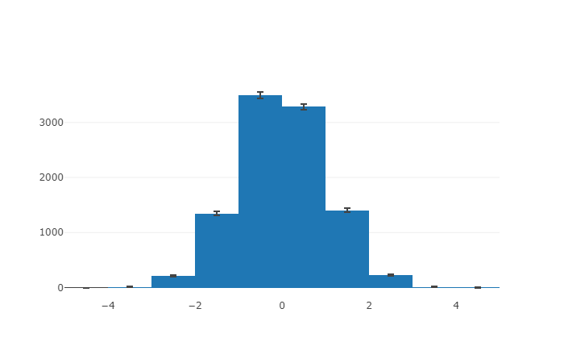

# pyjave

## Install

```
pip install pyjave
```

## Usage

```python
import pyjave
df = pd.DataFrame({'A': np.random.normal(size=10000), 
                   'B': np.random.normal(size=10000)})
df.A.jhist(bins=10, range=(-5,5))
```


